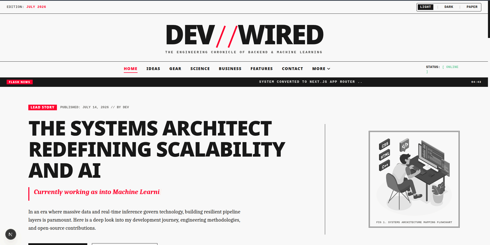

# DEV // WIRED PORTFOLIO



An editorial, print-digital newspaper hybrid developer portfolio inspired by the unique design layout of **Wired.com**. Built with **Next.js 16 (App Router)**, **React 19**, **Tailwind CSS v4**, and animated with **`motion/react`** (Framer Motion).

This project features three distinct styling themes: **Light Newsprint**, **Compact Cyber Dark**, and a completely static, zero-latency **Minimalist Paper mode** styled to behave like physical print media.

---

## 🛠️ Tech Stack & Key Upgrades

- **Next.js 16 (App Router)** – Modern structural routing replacing React Router DOM.
- **React 19** – Optimized hooks and client-side rendering.
- **Tailwind CSS v4** – Integrated with PostCSS compilation conditions.
- **motion/react** – Unified animation suite replacing heavy event-listener libraries like `aos`.
- **Zero Dependency Bloat** – Removed 6 unnecessary packages (`aos`, `react-scroll`, `react-masonry-css`, `react-spinners`, `react-typed`, `react-router-dom`) in favor of native CSS columns, standard Web API Intersection Observers, custom Typing hooks, and Tailwind loaders.

---

## 📂 Project Directory Structure

```text
├── package.json               # Next.js 16 dependencies & scripts
├── eslint.config.js           # ESLint layout configuration
├── jest.config.ts             # Jest environment & setup configurations
├── jest.setup.ts              # Jest lifecycle mocks & custom environments
├── next.config.mjs            # Next.js bundler and transpile config
├── postcss.config.mjs         # Tailwind CSS v4 PostCSS integration
├── tsconfig.json              # TypeScript compilation rules with aliases
├── public/                    # Grayscale editorial SVGs & assets
└── src/
    ├── app/                   # File-system router tree
    │   ├── globals.css        # Tailwind v4 directives & theme configurations
    │   ├── layout.tsx         # Metadata injections & Root layout
    │   ├── page.tsx           # Home section compiler
    │   ├── blog/              # Medium Feed rendering route
    │   ├── nest/              # Space grid & Spotify pipeline route
    │   ├── docs/              # Editorial reference listings
    │   │   └── git/           # Git CLI command dictionary
    │   └── not-found.tsx      # System 404 news bulletin
    └── components/            # Reusable React components
        ├── Navbar.tsx         # Wired header, Flash News ticker & Theme toggles
        ├── Footer.tsx         # Double-ruled copyright columns
        ├── LoadingSpinner.tsx # Dual-spinning custom CSS loader
        ├── MediumFeed.tsx     # RSS-to-JSON parsing card grid
        └── home/              # Individual page section components
            ├── Hero.tsx       # Lead story & Typewriter hooks
            ├── About.tsx      # Ideas column with dropped-capitals
            ├── Skills.tsx     # Gear spec cards with rating metrics
            ├── Education.tsx  # Science abstracts
            ├── Experience.tsx # Business employment logs
            ├── Projects.tsx   # Features cover-story columns
            └── Contact.tsx    # Letters-to-the-editor ticket form
```

---

## 🎨 Theme Modes

The portfolio includes a customized theme selector in the header banner:

1. **LIGHT** – Styled as an off-white newsprint paper (`#faf9f6`) with dark ink text and red accents.
2. **DARK** – A premium, high-contrast cyber dark workspace (`#080809`) with neon gray and red highlights.
3. **PAPER** – An ultra-minimalist, high-contrast monochrome paper style. **All animations, typing loops, scroll reveals, tilt hooks, and marquees are completely disabled globally** via CSS overrides to emulate standard static ink.

---

## 📦 Getting Started

Ensure you have [Bun](https://bun.sh/) or Node.js installed.

1. **Clone the repository**:

   ```bash
   git clone https://github.com/eatulrajput/personal_website.git
   cd personal_website
   ```

2. **Install dependencies**:

   ```bash
   bun install   # or npm install
   ```

3. **Start the local server**:
   ```bash
   bun dev       # or npm run dev
   ```

Open [http://localhost:3000](http://localhost:3000) in your browser.

---

## 🔄 Customization

- **Editorial content**: Edit section properties inside the components under `src/components/home/`.
- **Theme colors**: Adjust HEX tokens in `src/app/globals.css`.
- **Blog entries**: Change the Medium username endpoint in `src/components/MediumFeed.tsx`.

---

## 🧪 Testing, Linting & Formatting

This workspace is equipped with Jest for testing, ESLint for code analysis, and Prettier for code style consistency.

### Running Unit Tests
We use **Jest** (configured with JSDOM and `ts-node` support). Run the test suites via:
```bash
bun run test              # Run all tests once
bun run test:watch        # Run tests in watch mode
bun run test:coverage     # Run tests and generate coverage report
```

### Running Lint Checks
To check for code quality and syntax issues:
```bash
bun run lint              # Check for linting issues
```

### Running Prettier (Formatting)
To check or fix code formatting:
```bash
bun run format:check      # Check if files conform to code style
bun run format            # Automatically format all files
```

---

## 🙌 Contributions

Please refer to the [Contributing Guidelines](./CONTRIBUTING.md) and [Code of Conduct](./CODE_OF_CONDUCT.md) before pushing commits or creating pull requests.
